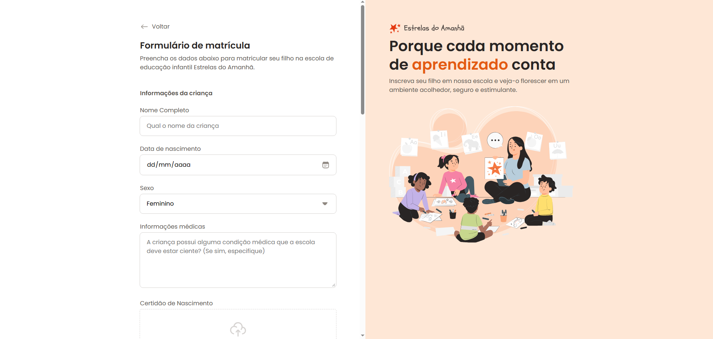

<!--  -->

# ⭐ Estrelas do Amanhã

Desenvolvido para realizar estilização e boas práticas com  ```Formulários``` Estrelas do Amanhã consta com um ótimo design responsivo e moderno.



## 🛠️ Construído com

* HTML - 
* CSS - 
* Responsividade - 
        
* Mobile First - 
* Media Queries - 


## ✒️ Autores

* **Julio Castro** - *Desenvolvedor* - [LinkedIn](https://www.linkedin.com/in/julio-cesar-castro-dev/)


## 🎁 Expressões de gratidão

* Foi uma ótima experiência desenvolver esse projeto e aperfeiçoar novas habilidades 📢;
* Imensa gratidão a equipe da RocketSeat pelo Design e aprendizado! - [RocketSeat](https://www.linkedin.com/school/rocketseat/posts/?feedView=all)
---
Escrito por [Julio Castro](https://www.linkedin.com/in/julio-cesar-castro-dev/) 😊
